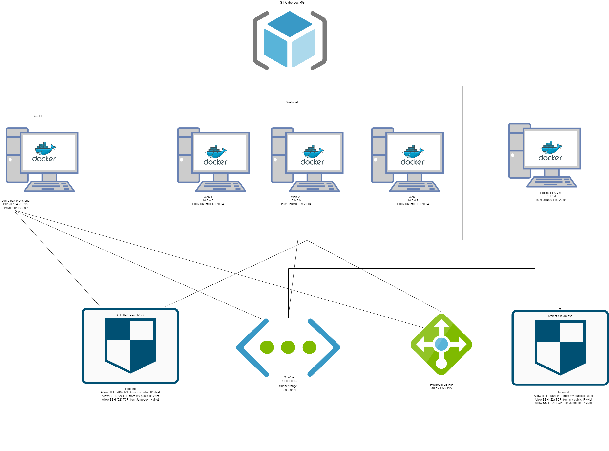
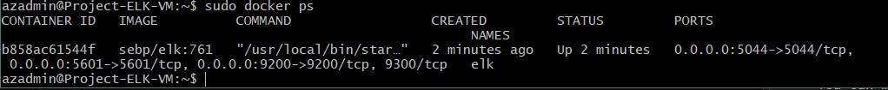

# GTcyber-portfolio
portfolio of GT cybersecurity projects

## Automated ELK Stack Deployment

The files in this repository were used to configure the network depicted below.

These files have been tested and used to generate a live ELK deployment on Azure. They can be used to either recreate the entire deployment pictured above. Alternatively, select portions of the install-elk.yml file may be used to install only certain pieces of it, such as Filebeat.

  - 

This document contains the following details:
- Description of the Topology
- Access Policies
- ELK Configuration
  - Beats in Use
  - Machines Being Monitored
- How to Use the Ansible Build

### Description of the Topology

The main purpose of this network is to expose a load-balanced and monitored instance of DVWA, the D*mn Vulnerable Web Application.

Load balancing ensures that the application will be highly Available, in addition to restricting traffic to the network.
- The offloading function of a loadbalancer defends against DDoS attacks by shifting attack traffic to the other servers. 
- An advantage of a jumpbox is to serve as a secure computer for all admins to first connect to for administrative tasks, used as a pivot point to connect to other servers or environments.

Integrating an ELK server allows users to easily monitor the vulnerable VMs for changes to the data and system logs.
- Filebeat monitors the log files or locations you specify, collects log events, and forwards them to Elasticsearch or Logstash for indexing.
- Metricbeat takes metrics and statistics and sends them to the output you spcify, such as Elasticsearch or Logstash. Metricbeat helps you monitor your servers by   collecting metrics from system services running on the server.

The configuration details of each machine may be found below.

| Name     | Function | IP Address | Operating System |
|----------|----------|------------|------------------|
| Jump Box | Gateway  | 10.0.0.4   | Linux            |
| Web-1    | Gateway  | 10.0.0.5   | Linux            |
| Web-2    | Gateway  | 10.0.0.6   | Linux            |
| Web-3    | Gateway  | 10.0.0.7   | Linux            |
| elk-vm   | Gateway  | 10.1.0.4   | Linux            |

### Access Policies

The machines on the internal network are not exposed to the public Internet. 

Only the JumpBox machine can accept connections from the Internet. Access to this machine is only allowed from the following IP addresses:
- My.Pub.lic.iP (My PiP)

Machines within the network can only be accessed by JumpBox-VM via SSH.
-  Which machine did you allow to access your ELK VM? JumpBox-Provisioner-VM
-  What was its IP address? 20.124.218.159

A summary of the access policies in place can be found in the table below.

| Name     | Publicly Accessible | Allowed IP Addresses |
|----------|---------------------|----------------------|
| Jump Box | Yes                 | 20.124.218.519, My.Pub.lic.IP, 10.0.0.4    |
| Elk-VM   | Yes                 | 20.122.131.41, My.Pub.lic.IP, 10.1.0.4     |
| Web-1    | No                  | 10.0.0.5                     |
| Web-2    | No                  | 10.0.0.6                     |
| Web-3    | No                  | 10.0.0.7                     |

### Elk Configuration

Ansible was used to automate configuration of the ELK machine. No configuration was performed manually, which is advantageous because...
- The main advantage of automating configuration of the ELK machine using Ansible is that it's very easy to set up and use. No special coding skills are       needed to use Ansible's playbooks. It allows for modeling of complex IT workflows, and is able to orchestrate entire application environments where           deployed. Helps secure and speed up provisioning of user access. 

The playbook implements the following tasks:
- Install Docker.io
- Install Python3-pip
- Install Docker using pip
- Install ELK
- Enable Docker sevices

The following screenshot displays the result of running `docker ps` after successfully configuring the ELK instance.

### Target Machines & Beats
This ELK server is configured to monitor the following machines:
| Web-1    | 10.0.0.5    |
| Web-2    | 10.0.0.6    |
| Web-3    | 10.0.0.7    |

We have installed the following Beats on these machines:
- Filebeat 
- Metricbeat

These Beats allow us to collect the following information from each machine:
- Filebeat collects data such as audit logs and server logs which track changes made to the system, and user logon events.
- Metricbeat collects data on internal metrics specified such as CPU usage, RAM usage, and storage data usage.

### Using the Playbook
In order to use the playbook, you will need to have an Ansible control node already configured. Assuming you have such a control node provisioned: 

SSH into the control node and follow the steps below:
- Copy the '/etc/ansible/files/filebeat-config.yml' file to '/etc/filebeat/filebeat-playbook.yml'.
- Update the filebeat-config.yml file to include username 'elastic' password 'changeme'. Scroll to line #1106 and replace IP address with IP of your ELK       machine [10.1.0.4:9200]. Scroll to line #1806 (kibana) and replace IP address with IP of your ELK machine [10.1.0.4:5601]. Save it in                         '/etc/ansible/files/filebeat-config.yml'.
- On ansible run the 'filebeat-playbook.yml', and navigate to ELK server GUI [http://20.122.131.41:5601/app/kibana] to check that the installation worked as   expected.

- _Which file is the playbook? filebeat-playbook.yml & metricbeat-playbook.yml 
- _Where do you copy it? '/etc/filebeat/filebeat-playbook.yml' & '/etc/metricbeat/metricbeat-playbook.yml'
- _Which file do you update to make Ansible run the playbook on a specific machine? filebeat-config.yml & metricbeat-config.yml 
- _How do I specify which machine to install the ELK server on versus which to install Filebeat on? By editing the '/etc/ansible/hosts' file under [webservers] you would specify web servers addresses, same with [elk] specify the IP address of the machine to install each specific playbook. 
- _Which URL do you navigate to in order to check that the ELK server is running? [http://20.122.131.41:5601/app/kibana] to ensure ELK server is running.

_As a **Bonus**, provide the specific commands the user will need to run to download the playbook, update the files, etc._

'docker-container start'
'docker-container attach [insert-container-name]'
'apt-get update'
'apt-get install curl'
'ansible-playbook install-elk.yml'
'ansible-playbook filebeat-playbook.yml'
'ansible-playbook metricbeat-playbook.yml'

